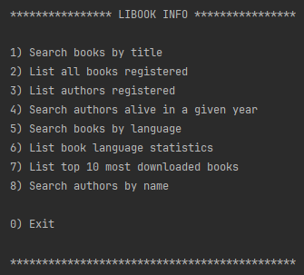

# LIBOOK INFO

Exploring and discovering books and authors, offering insights into literary works, author timelines, and 
more. Integrates Gutendex API for real-time book title searches.

## ✔️ Features:

- NOTE: Option 1 is the only one that uses the Gutendex API

## 🔨 Tools:

- Java
- [Gutendex API](https://gutendex.com/)
- Spring boot
    - Data jpa
    - Web
- Postgres

## ☕️ How to use:

1. Choose option 1 to search for books in the api and populate the db (skip to step 3)
2. Choose any of the options
3. If necessary, fill in what is requested
4. Return to step 2 or Exit

## 📁 Access to the project:

1. Clone this repository: https://github.com/kamille-rabelo/libook-info.git
2. Create a database called "libook_info"
3. Create system environment variables: "DB_HOST", "DB_USER" and "DB_PASSWORD"
4. Run "LibookInfoApplication"